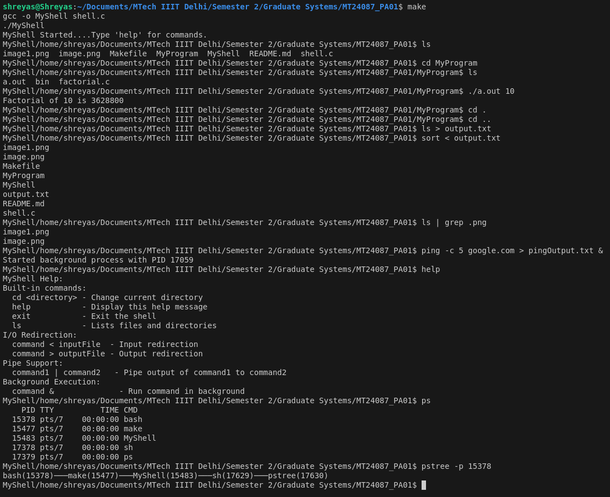

# 🚀 Welcome to MyShell: A Custom Linux Shell Implementation

## Overview

MyShell is a custom Linux Shell Implementation written in C, providing basic shell functionality with support for various command execution modes, built-in commands, I/O redirection, piping, and background process management.

## Features

### Built-in Commands
- 📁 `cd`: Change current directory
- ❓ `help`: Display help information
- ❌ `exit`: Exit the shell

### Advanced Functionality
- ♻️ **I/O Redirection**
  - Input redirection: `command < input_file`
  - Output redirection: `command > output_file`
- ⏫ **Pipe Support**: `command1 | command2`
- 🌐 **Background Process Execution**: `command &`

## Compilation and Building

The compilation and execution are handled through the `Makefile`. 

Simply run: **`make`**

This command compiles the source code and automatically runs the shell.

### Makefile

The provided `Makefile` automates the compilation and execution process:

- **`make`**: Compiles the source code and runs the shell.
- **`make clean`**: Removes the compiled `MyShell` executable.

## Shell Behavior

### Command Processing
1. Supports complex command parsing
2. Handles up to 256 arguments per command
3. Supports input and output redirection
4. Enables piping between commands
5. Allows background process execution

## Implementation Details

### Key Functions
- `getCurrDir()`: Retrieves and updates current working directory
- `parseInput()`: Tokenizes user input into arguments
- `runCommands()`: Executes commands with various processing modes
- `setupPipe()`: Manages command piping
- `runBackgroundCommand()`: Handles background process execution

### Process Management
- Uses `fork()` for creating child processes
- Implements zombie process reaping
- Supports safe process creation and termination

### Commands Implemented with sample examples

 - `Change directory`: cd MyFolder

 - `List files`: ls

 - `Show all available commands `: help
 
 - `Input Redirection`:cat < input.txt
 
 - `Output Redirection`: ls > files.txt

 - `Piping`: ls | grep .txt

 - `Background command execution`: long_running_script &

#### Process Tree Visualization

Using the `ps` command, the following processes were displayed:
- **bash**: This represents my terminal shell.
- **a.out**: This is my custom shell.
- **sh**: A child process created by my custom shell to handle commands.
- **ps**: The command used to display the list of processes.

This confirms that `a.out` (my shell) successfully created additional processes like `sh`.

Using the `pstree` command, the following relationship was visualized:

This shows:
- **a.out (PID 21454)**: The custom shell acting as the parent process.
- **sh (PID 22231)**: A child process spawned by the custom shell.
- **pstree (PID 22232)**: A process created by `sh` to visualize the process tree.

The process tree demonstrates that the custom shell is effectively managing and creating child processes as required.

## Error Handling
- Provides descriptive error messages
- Handles various potential failure scenarios
- Safe process management

